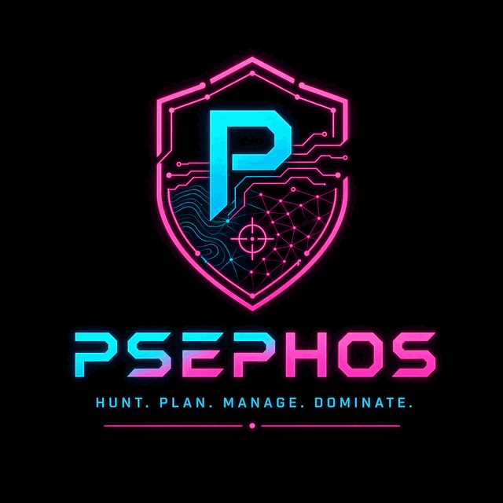
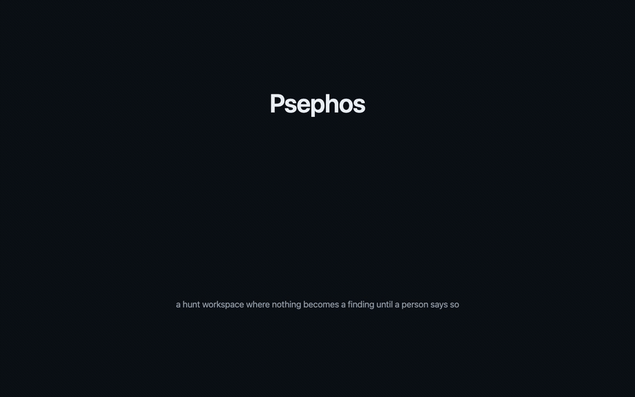
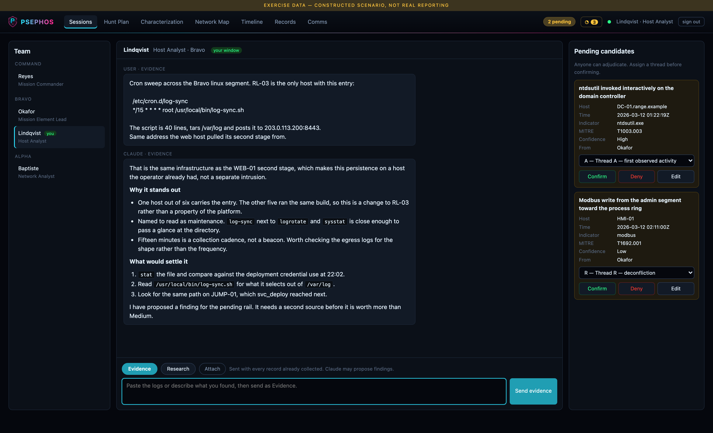
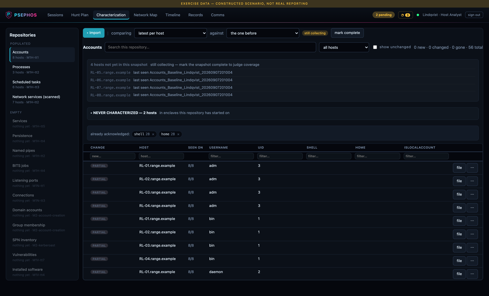
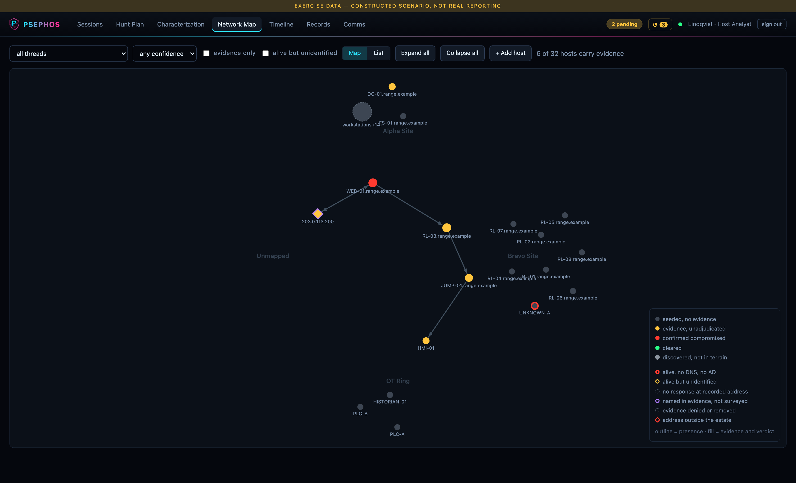
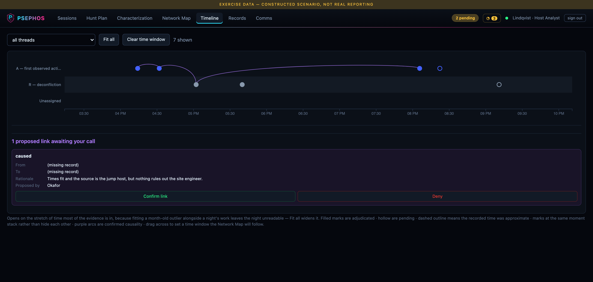
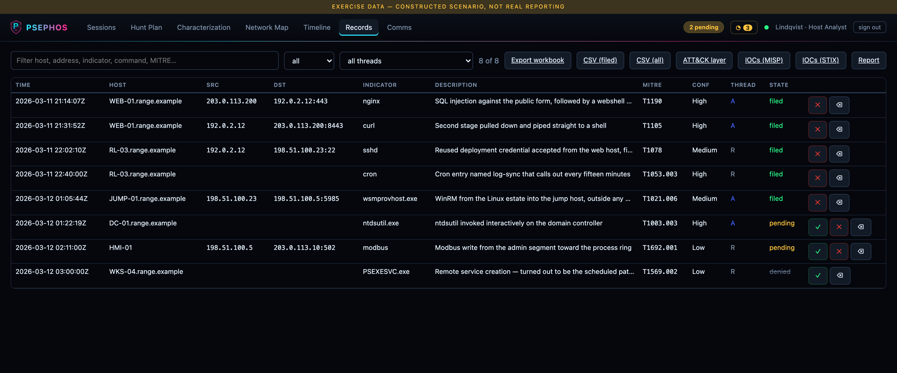
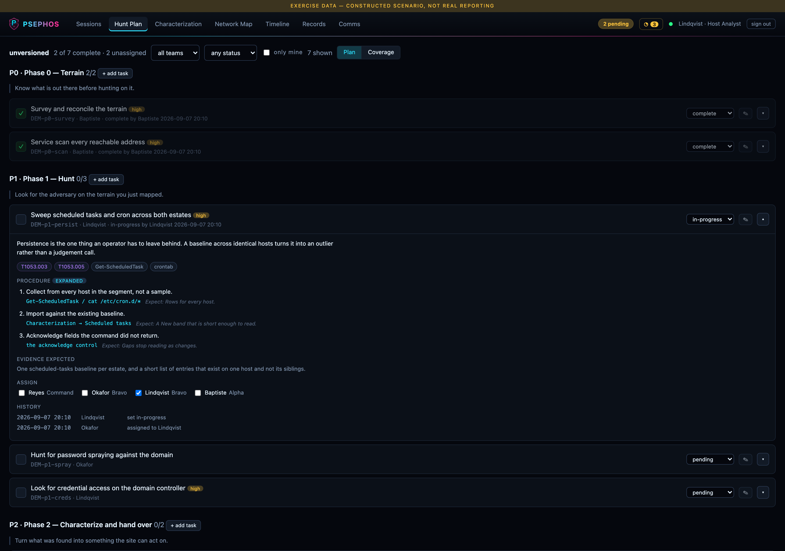
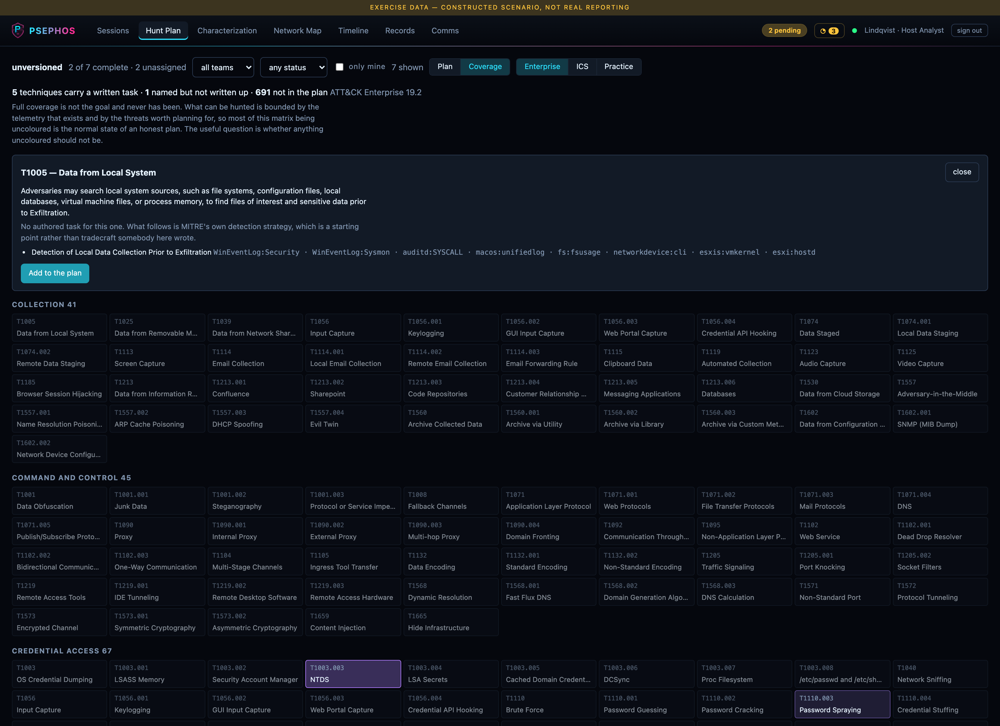
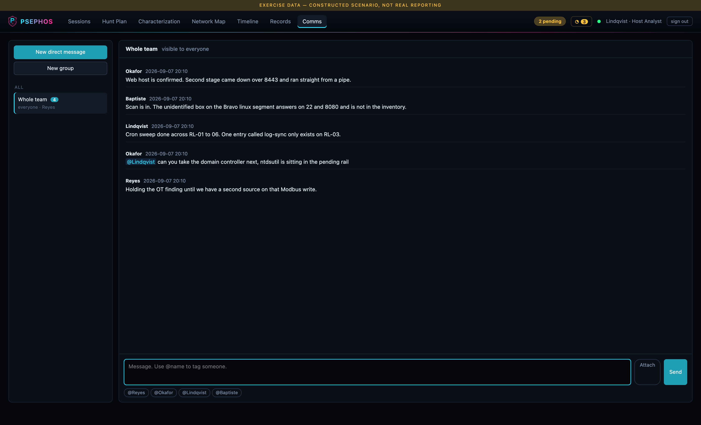

<p align="center"></p>

# Psephos

*ψῆφος* — the pebble an Athenian juror dropped into an urn to cast a verdict. Not a
metaphor for judgement: the object that carried one. It is the right name for this,
because nothing here becomes a finding until a person decides it has.

A locally hosted, defender-themed workspace for cyber hunt sessions. You talk to Claude
about evidence; Claude proposes structured findings through typed tools; you confirm or
deny them. A Network Map, a Timeline and a set of characterization baselines render the
resulting store and update live for everyone on the team.

No `npm install`. No build step. Node 24 built-ins and one vendored copy of D3.



*Eighty-five seconds of it working. There is a [cleaner MP4](docs/psephos-reel.mp4), a
[narrated version with subtitles](https://github.com/japatton/psephos/releases/latest), and a
[five-minute tour](https://github.com/japatton/psephos/releases/latest) that starts from an
empty clone and includes a real model turn.*



> Every screenshot and recording here is from synthetic data on a documentation network. See
> [Try it without an engagement](#try-it-without-an-engagement).

## Start

**What you need.** Node 24 or newer, and nothing else installed — no `npm install`, no
build step. For the default model backend you also need the [Claude Code
CLI](https://claude.com/claude-code) on the machine and logged in; it holds its own
credentials and this application never reads them. An Anthropic or OpenAI-compatible API
key works instead, if the CLI is not an option where you are — see
[Which model runs it](#which-model-runs-it). The terrain survey scripts need PowerShell 7,
and the screenshot tool and browser-driven tests need Chrome or Edge; neither is needed to
run the application.

```bash
node bin/serve.js
```

It binds every interface by default so teammates can reach it. Set `HUNT_HOST=127.0.0.1`
unless you mean to share it, and read [Read this before putting it on a
network](#read-this-before-putting-it-on-a-network) before you do.

The first start has no mission, so the server comes up in **setup** and serves a wizard
until one is chosen — it will not guess. Guessing is the failure that matters: a server
started against the wrong terrain re-seeds, finds that terrain no longer mentions most of
its hosts, and takes them off the map along with every verdict recorded against them.

The console prints the URL, the operator token and, once a mission is loaded, one token per
teammate. The operator token is generated on first start and saved to `.hunt-token`
(gitignored). Open the URL and paste a token — **the token says who you are**, so there is
no name to type and no name to get wrong.

| Variable | Default | Meaning |
|---|---|---|
| `HUNT_PORT` | `8787` | Listen port |
| `HUNT_HOST` | `0.0.0.0` | Bind address. Set `127.0.0.1` for loopback only. |
| `HUNT_DB` | `data/hunt.db` | SQLite store. Created 0600; see [Read this before putting it on a network](#read-this-before-putting-it-on-a-network) |
| `HUNT_MISSIONS` | `missions/` | Where mission profiles live |
| `HUNT_MISSION` | — | Force a profile, ignoring the saved pointer |
| `HUNT_MISSION_FILE` | `data/mission` | Where the chosen profile is remembered |
| `HUNT_PLAN` | `data/plan.json` | The live, editable plan |
| `HUNT_CLAUDE_BIN` | `claude` | Path to the Claude CLI |
| `HUNT_MODEL_CONFIG` | `data/model.json` | Provider, model and credential. Written 0600; see [Which model runs it](#which-model-runs-it) |
| `HUNT_MAX_TOOL_STEPS` | `12` | Tool calls a single API-backed turn may make before it is stopped |
| `HUNT_HISTORY_TURNS` | `20` | How much transcript is resent each turn — HTTP APIs have no session to resume |
| `HUNT_BACKUP_MINUTES` | `30` | Snapshot interval. `0` disables; a snapshot is also taken on shutdown |
| `HUNT_BACKUP_KEEP` | `20` | Snapshots retained before the oldest is pruned |
| `HUNT_TURN_TIMEOUT_MS` | `600000` | Kill a stuck turn after this long |
| `HUNT_SSE_MAX_BUFFER` | `262144` | Unsent bytes a live-update client may hold before it is dropped and left to reconnect |
| `HUNT_SESSION_CWD` | `data/session-cwd` | Empty directory hunt subprocesses run in |

## Mission profiles

A profile is a directory holding the four things specific to one engagement and generic to
none:

```
missions/<code>/
  mission.json    name, week, briefing
  terrain.json    enclaves, segments, hosts
  roster.json     who is on the team, in chain-of-command order
  plan.json       the seed hunt plan
```

They live outside the source tree because a network map and a team list are not source, and
this repository gets pushed. Only `missions/example` is tracked, and `repo-hygiene.test.js`
fails the build if a second profile ever appears, if a tracked file names a routable
address, a roster surname or the exercise itself, or if a binary lands anywhere but
`docs/screenshots`.

What it searches for is read from the profiles on this machine at runtime rather than
listed in the test, so the guard names no engagement itself and works unchanged for the
next one. On a clone with no profile it skips rather than passes — a green tick for a check
that had nothing to look for is worse than an honest gap.

Re-seeding **reconciles** rather than appends. A survey that relocates a host updates the
existing row in place — keeping its id so audit history still resolves, and keeping its
verdict, which is the analyst's call and never the survey's. Rows the terrain drops are
removed, and any verdict lost that way is reported rather than swallowed. A host the
evidence discovered before the survey named it is absorbed into the terrain entry instead of
appearing twice.

## Read this before putting it on a network

The server defaults to `0.0.0.0` so teammates can reach it. That has consequences worth
stating plainly:

- **Anyone who can reach the port and holds a token can read every unreviewed finding**
  in the store, and can spend your Claude quota by starting sessions.
- **The member token is attribution, not authentication.** It decides who you are, which
  makes attribution automatic; it does not decide what you may see.
- **There is no TLS and no token rotation.** This is appropriate for a trusted exercise
  LAN and inappropriate for anything else.

Set `HUNT_HOST=127.0.0.1` if you did not mean to share it.

### How the Claude subprocess is contained

Every turn spawns `claude -p` with:

- `--strict-mcp-config` so the session gets **only** this app's MCP server. Without it, any
  MCP servers configured in your own CLI — Gmail, Drive, anything else — are inherited into
  a LAN-exposed session.
- An **exhaustive `--disallowedTools` list**. `--allowedTools` is additive, not exclusive:
  passing only an allowlist still leaves `Read`, `Glob`, `Grep` and `ToolSearch` enabled,
  which is arbitrary file read as your user. Note that on Windows the shell tool is
  `PowerShell`, not `Bash` — denying only `Bash` would leave shell execution wide open.
- **A dedicated empty working directory.** CLAUDE.md discovery and the auto-memory namespace
  are both keyed to the subprocess cwd. Inheriting the server's would pull your project
  instructions and personal memory files into a session any LAN teammate can start.

Last verified against claude 2.1.236: with these flags the subprocess starts with **zero** tools
and gains only this app's. `test/invariants.test.js` asserts the contract holds.

`--bare` looks like it would help here — it skips hooks, auto-memory and CLAUDE.md — but it
also disables keychain reads, so auth becomes strictly `ANTHROPIC_API_KEY` and every turn
returns "Not logged in". It is deliberately not used; the reason is recorded in
`claude/runner.js` so it is not retried.

Turns also set `SUPERPOWERS_SKIP_SESSION_START=1`, which suppresses the superpowers
SessionStart preamble (~1.6k tokens per turn, instructing the model to use skills this
subprocess is denied). Harmless if that plugin is not installed.

**The application never reads your credentials.** The CLI authenticates itself exactly as it
does in your terminal, including token refresh. A test fails the build if any source file
references the credential store. An optional API key may be configured instead, in which
case it is stored `0600`, never logged, never returned to the browser, and readable by
exactly two modules.

**The store is owner-only, and so are its backups.** `data/hunt.db` holds every member's
token in plaintext alongside the case file, the direct messages and the bytes of every
uploaded file, so it is chmodded `0600` when it is opened — before the first write, so the
WAL and shared-memory files SQLite creates beside it inherit the same mode — and each
`VACUUM INTO` snapshot in `data/backups` is chmodded as it is written. On a host shared
with other local accounts the alternative is that any of them can read the tokens and sign
in as any analyst.

## The team

One persistent chat per person, seeded on first start from the mission profile's roster.
There is no "new session" step: the roster **is** the session list, so there is never a
question about whose window is whose.

The roster is a list of name, role and team, in the order they should appear — a team
writes its chain of command down once and the UI reflects it:

```json
{ "members": [
  { "name": "Reyes",  "role": "Mission Commander",    "team": "Command" },
  { "name": "Okafor", "role": "Mission Element Lead", "team": "Bravo" }
] }
```

Each gets an 8-character token, printed on server start and readable later with
`tools/Show-Tokens.ps1`. The alphabet omits `0/O` and `1/I/L`, because twelve people are
going to read these off a screen and type them.

**The token is not a password.** It decides who you are, which makes attribution automatic
and stops a misdirected paste landing in a colleague's chat. Everyone can read every
window — review across the team is the point. Only the owner can post in theirs, enforced
server-side, not just hidden in the UI. Tokens are never sent to the browser.

## Evidence and Research

Two buttons on the composer, and they are genuinely different channels.

**Evidence** submits an observation to be judged against the **whole case file**, which is
included in the prompt. Claude checks for duplicates first, then proposes findings and
causal links through the tools; proposals land in the pending rail with a thread selector,
and nothing enters the case file until someone confirms it.

**Research** is a question: how to read a log format, how to block an address on the
firewall, how to enumerate local users. It records nothing.

Research mode is enforced by **withholding the writing tools**, not by asking politely.
`propose_finding` and `propose_edge` are added to the denylist for the turn, so a research
exchange cannot write to the case file even if the model concludes the analyst wanted it
to. Verified: asked directly to "file this as a confirmed finding right now", it declines,
points at the Evidence button, and the record count does not move.

**Attach** takes up to five files, uploaded on send rather than pasted into the box. The
artifact is kept in the store so a record can point at it by hash, and the server decides
how much of it goes in front of the model: text is inlined up to 200,000 characters with a
visible truncation marker, binary is described by hash and never decoded.

## What a session does

Claude gets six tools and nothing else:

| Tool | Purpose |
|---|---|
| `propose_finding` | File one record in the 18-column analyst schema, as **pending** |
| `propose_edge` | Link two records causally, as **proposed** |
| `query_terrain` | Look up the engagement hosts and segments |
| `search_records` | Check the store before proposing a duplicate |
| `stage_entities` | File extracted rows into a characterization repository |
| `query_baseline` | Ask what normal looks like, and on how many hosts |

Nothing the model proposes enters the case file until you promote it.

### Which model runs it

Three backends, chosen in the setup wizard and changeable later:

| Provider | What it needs | Notes |
|---|---|---|
| **Claude CLI** | nothing | The default. The CLI holds its own auth, so the application never sees a credential. |
| **Anthropic API** | an API key | Set a model, or take the default. |
| **OpenAI-compatible** | an API key and a base URL | Anything speaking `/chat/completions` — the OpenAI API itself, a local vLLM or llama.cpp server, an in-house gateway. |

The six tools above are the same on every backend. On the CLI they arrive as an
MCP server; on the HTTP APIs the identical schemas are sent as tool definitions
and the turn loop executes the calls itself. The mode's tool list is what the
model is offered, so a research session cannot file a record on any provider.

The credential is the reason this is narrower than it looks. It is written to
`data/model.json` at 0600 and read by exactly one function, which no route
calls; `modelConfig()` — the one an API can return — omits it, the startup
banner names the provider and never the key, and `test/invariants.test.js`
holds that line. The property being protected is that a LAN-exposed origin
cannot hand out a credential.

A base URL pointing at a machine you run keeps the case file on your own
hardware, which is the reason the OpenAI-compatible path takes an arbitrary
endpoint rather than assuming `api.openai.com`.

### Trial an endpoint before you depend on it

The plumbing is provider-agnostic; whether a given model can actually drive six tool
schemas is a different question, and a smaller local model is where it gets interesting.

```bash
node tools/probe-model.mjs --base-url http://10.0.0.5:8000/v1 --model qwen2.5-32b-instruct --key sk-local
```

Six scenarios — one per tool, in the mode that offers it, plus one where the right answer
is to call nothing — each run several times, because the failure that matters is
intermittent. It reads the schemas and the per-mode tool lists from the application rather
than a copy, touches no store and no session, and never reads or writes a saved
credential. Exits non-zero unless every scenario passes every run.

What it catches is what small models actually do: return a confident paragraph instead of
calling anything, reach for a tool from another mode, emit almost-JSON, call
`propose_finding` with an empty description, or file a record because somebody said good
morning. Each of those looks like a working hunt right up until you read the case file.

## The three verdicts

- **Record triage** — New / Investigating / Corroborated / Ruled Out, plus confirm or deny.
- **Host compromise** — unknown / suspected / confirmed / cleared. Independent of the
  records beneath it: denying one record never silently clears a host.
- **Causality** — confirm or deny a proposed link. Confirmed links draw the attack chain as
  arcs on the timeline.

Each writes exactly one audit row with analyst, timestamp and before/after, and broadcasts
over SSE so other open browsers update immediately.

## Characterization

What normal looks like, so a finding has something to be judged against. An unfamiliar
process name on one host out of eighty is worth a look; the same name on all eighty is
inventory.



Rows are filed into one of nineteen **repositories** — accounts, processes, scheduled tasks,
services, persistence, named pipes, BITS jobs, network services, listening ports,
connections, domain accounts, group membership, SPNs, vulnerabilities, installed software,
command history, shares, host configuration, and unclassified. Paste a collection into the
Import box and Claude extracts the rows and files them through `stage_entities`.

**Everything is scoped to the repository you are in.** Pick Processes and the snapshot
dropdowns, the import prompt, the coverage list and the comparison are all about processes.
Nothing from another repository appears.

**Snapshots are named, not numbered.** `Processes_Baseline_Lindqvist_20260826083024` —
repository, kind, who took it, when. Two operators comparing notes over a radio can say
which one they mean.

**Identity is per repository.** Each one decides what makes two rows the same thing, and
the choice is the whole game: a scheduled task is keyed on its path where it has one, so a
cron job named `logrotate` in `/etc/cron.daily` is not the same object as one in
`/etc/cron.d`; software is keyed on name and architecture so a version bump reads as one row
changing rather than one package leaving and another arriving. Get this wrong and two
different things silently fold into one. A fold guard flags it when a comparison collapses
more rows than it should.

**Missing fields are acknowledged, not guessed at.** Operators run different commands.
`getent passwd` without the shell and home columns is not evidence that shells changed —
but a naive comparison reports every row as Changed, and a hundred false changes is the same
as no signal at all. Acknowledge the fields a collection did not return, at whatever scale
they are missing, and those rows band as **Partial** with the note that the data was absent
and the absence was accepted. They stop counting as changes.

**Coverage is stated rather than implied.** A snapshot lists the hosts it has not reached
yet and when each was last seen, and stays "still collecting" until someone marks it
complete. A repository also lists every host in its enclaves that has *never* been
characterized — the full list, copyable, because the next step is usually to go check
reachability in another tool.

Column names are matched across spellings: `task.name`, `UserName` and `username` all
resolve to the same field, so an operator keeps their source's own headers.

## Network Map

Force-directed, clustered by enclave. Segments render collapsed with a host count and open
on click; segments already holding evidence open automatically.



- grey — seeded terrain, no evidence
- amber — evidence present, not adjudicated
- red — confirmed compromised
- green — cleared
- **diamond** — a host discovered from evidence that is absent from terrain

Presence rides on the **outline** so the fill can keep meaning evidence and verdict: a
bright amber ring is alive-but-unidentified, a dashed grey outline is no-response, a purple
ring is evidence-only.

Edges are derived from the records on read, never stored, so the graph cannot drift from the
evidence that justifies it. Denying a record withdraws its edge; archiving one removes it
from the map entirely.

Click a host for its drawer: verdict, presence, the records naming it, and **its latest
characterization** — what each repository last saw on that host and when.

## Timeline

One swim lane per thread. Filled marks are adjudicated, hollow are pending, and a dashed
outline means the recorded time was approximate. Confirmed causal links draw as arcs;
proposed ones wait below for a call.



It opens on the **densest cluster** rather than on everything, because fitting a month-old
outlier alongside a night's work leaves the night unreadable. **Fit all** widens it.

Event times in real analyst data are inconsistent — `2026-08-13 17:59:02Z`,
`2026-08-19 ~11:59`, `Scheduled: 0 18 * * 3`, `N/A (host forensics)`. Each is tiered as
**exact**, **approximate**, or **unplaceable**. Unplaceable records are docked in a tray
below the axis, never dropped, and the view says how many it could not draw.

Drag across the timeline to set a window; the Network Map follows it.

## Records and archiving

The case file as a table: filter, adjudicate, export.



Denying a finding settles what the evidence showed. **Archiving** retires it: off the
timeline, off the map, out of the case file Claude is shown, and out of the connections it
implied. Nothing is deleted — archived records and hosts stay readable and restorable. The
distinction matters because a denied finding is a judgement worth keeping, while a cleared
host that still draws ghost edges on the map is just noise.

Hosts archive the same way, for the addresses that turn out to be somebody else's scanner.

## Hunt plan

Phases and tasks, seeded from the profile and edited in the UI. Each task carries intent,
MITRE technique, tooling, the procedure to run, what evidence to expect, who it is assigned
to, and its own history.



The file is the authority and the database is re-derived from it on every start, so a week
of team edits cannot be lost to a restart. Writes are atomic with a rolling backup.

### The bank, and coverage of intent

A plan has to be built out of something. The **bank** is a catalogue to draw from: every
live ATT&CK technique — 697 Enterprise, 97 ICS — plus a set of entries that have no
technique id at all, because ATT&CK describes adversary behaviour and not the work around
hunting it. Those cover telemetry blind spots, stating a hypothesis so that finding nothing
means something, and deconfliction.

Drawing an entry **copies** a whole task into the plan. The bank does not change, the copy
is an ordinary task from the moment it lands, and there is no sync to get wrong — the cost
being that improving a bank entry later does not reach plans already built from it. That is
the right trade: a plan records what a team decided to do, not a live view of a catalogue.

**Coverage** is the other half, and it answers a different question from the ATT&CK
Navigator export elsewhere in this tool. The export says what was *found*. This says what
the plan set out to *look for*, computed from its MITRE ids, and the gap between the two is
the useful part.



Three states, not two: nothing in the plan names it, a task names it but nobody has written
anything under it, or a task names it and carries steps. A plan of forty stubs looks
thorough in a list and is not one, and that distinction is the reason the view exists.

**The matrix is the way into the bank.** Nobody browses eight hundred entries; a gap is what
makes one relevant, so the entry opens from the cell.

Three things it is deliberately honest about:

- **Full coverage is not the goal**, and the view says so in words. What can be hunted is
  bounded by the telemetry that exists and the threats worth planning for, so most of the
  matrix being uncoloured is the normal state of an honest plan. A wall of empty cells with
  no explanation reads as failure, and it is not one.
- **Generated is never dressed as authored.** Four states, and they read differently
  everywhere they appear — in the panel, and on the task after it is drawn. A **stub**
  offers MITRE's own detection strategy and says that is what it is. A **draft** was
  written from general practice and checked by nobody. A **reviewed** entry has been read
  line by line, against MITRE's own description and against the authored entries, by a
  second model pass that did not write it — that pass corrected commands returning
  nothing, Zeek fields that do not exist and several arguments whose central claim was
  untrue, and where a fix meant rewriting rather than editing, the entry stayed a draft.
  It is a real check and it is not a human one; the badge says which. Only **authored**
  claims a person with a real engagement in front of them stood behind the argument. The ladder is about what backs an entry, and the flattering value is never a
  default: promoting one means moving it between files by hand.
- **A technique ATT&CK has revoked is called out**, not swallowed. A task naming a
  renumbered id colours no cell and counts toward nothing, so without saying so the plan
  would claim ground the matrix cannot show. This found five in this repository's own plans
  the day it was written.

## Comms

A separate tab from hunt sessions, on purpose: a session is a conversation with Claude that
can produce records, a channel is people talking to each other and produces nothing but its
own history.



- **Whole team** channel exists from first start; everyone sees it without being added.
- **Direct messages** are the one place in this tool where reading is not open. Opening a DM
  with the same person twice lands in the same conversation rather than making a second one.
- **Groups** are named and include their creator.
- **@name** is matched against the roster, case-insensitively. A tag of someone not on the
  roster is not a mention.
- **Unread counts** ignore your own messages and clear when you open the channel.

### Notifications

A bell in the header, per person. It fires on the two things you would otherwise have to
notice by luck: **someone assigns you a task**, and **someone @-mentions you in chat**. Each
notification links to the thing it is about. Live over SSE, so it arrives without a reload.

Live updates never steal your cursor. A repaint triggered by someone else's action preserves
focus, selection and caret position, so a teammate sending evidence cannot disturb what you
are typing.

## Presence: did it answer?

Separate from **verdict**, which records whether a host is compromised. Presence only
records whether something answered and whether we know what it is. A box that replies to a
ping is not thereby clean, and the two must never be read as one field.

| Presence | Meaning |
|---|---|
| `confirmed` | Answered at its recorded address |
| `relocated` | Answered, but on a different address than recorded |
| `unanswered` | Probed and nothing replied. **Not** "dead": may be filtered, off, moved, or not routable from where the survey ran |
| `excluded` | Deliberately not contacted. Says nothing about the host, only about the scope |
| `out-of-scope` | Outside the surveyed range entirely |
| `alive-named` | Answered and resolved, but absent from the inventory |
| `alive-unidentified` | **Answered, no name, no role.** The one worth chasing |
| `infrastructure` | Answered on the segment's gateway address |
| `evidence-only` | Named in evidence but never surveyed |
| `unsurveyed` | No survey has covered it |

`excluded` and `out-of-scope` exist because reporting "no response" for an address the
survey never contacted is a false negative: it reads as though someone looked. Excluding
your own tooling enclave is the common case — on one run, 21 of its hosts were being
reported as silent when nothing had ever been sent to them.

## Files

Uploads live in the store rather than on disk: one file to back up, no path handling, and
nothing on the filesystem for a LAN visitor to reach by any route but the API. 25 MB cap,
SHA-256 recorded on every upload.

Downloads are always served as `application/octet-stream` with `Content-Disposition:
attachment`, `X-Content-Type-Options: nosniff` and a locked-down CSP. Serving an uploaded
file with its own content type would mean a teammate uploading an `.html` or `.svg` gets
script execution on this origin — which is every token and every record in the store.

**Files can be sent as evidence.** Attach one in a hunt session and the server decides how
much of it is safe to put in front of the model: text is inlined with its name, size and
hash; binary is described by hash and never decoded, because a megabyte of mojibake helps
nobody. The artifact stays in the store either way, so a record can point at it.

## Terrain

Terrain is read-only at runtime and comes from the profile. Generate it from a survey, or
from an asset-inventory export:

```bash
pwsh tools/Invoke-TerrainSurvey.ps1        # one JSON per vantage
pwsh tools/Merge-Terrain.ps1               # merge the vantages
node terrain/extract.mjs path/to/assets.html
```

Hosts carry `presence`, `domainJoined`, `nameConflict` and `observedFrom` provenance. Hosts
discovered from evidence are added automatically and marked `discovered`, which is how an
address nobody entered appears on the map.

> The example inventory lists **ControlThings and Sift at the same address**
> (`10.40.1.5`). Both are kept rather than silently deduplicated — probably a typo in the
> inventory, but the store should not decide that for you.

## Importing an existing case

```bash
node tools/import-csv.mjs records.csv --state filed --thread D
```

Reads the 18-column CSV, maps the headers, tiers every event time, and resolves each address
against terrain. There are matching importers for Nessus output and for an existing hunt
plan.

## Export

**Workbook** — `GET /api/export/records.xlsx?state=filed` produces a real `.xlsx`: a legend
sheet followed by one sheet per thread. Frozen header row, autofilter, wrapped text. Written
with `node:zlib` and no dependency — an xlsx is a zip of XML. Verified against openpyxl, not
just its own reader.

**CSV** — `GET /api/export/records.csv?state=filed` gives the original 18 columns, in order,
RFC 4180 with a BOM so Excel reads it as UTF-8.

Both take `state=all` to export everything rather than just filed records.

## Backups

```bash
node tools/backup-db.mjs before-the-thing
```

Uses `VACUUM INTO` rather than copying the file. SQLite in WAL mode keeps recent writes in a
sidecar, so `cp hunt.db` captures whatever had been checkpointed and silently leaves the
rest behind — a stale snapshot that looks fine until you need it. `VACUUM INTO` writes a
single self-contained database with everything committed at the moment it runs.

## Try it without an engagement

Fill a scratch store with a synthetic exercise — 32 hosts on documentation addresses, a web
intrusion that reaches an OT ring, baselines with a real field gap in them, and a plan:

```bash
mkdir -p /tmp/demo/missions
HUNT_MISSIONS=/tmp/demo/missions HUNT_MISSION=demo HUNT_DB=/tmp/demo/hunt.db HUNT_PLAN=/tmp/demo/plan.json node tools/demo-data.mjs
```

Then serve it, from inside that directory so it keeps its own token:

```bash
cd /tmp/demo && HUNT_MISSIONS=/tmp/demo/missions HUNT_MISSION=demo HUNT_DB=/tmp/demo/hunt.db HUNT_PLAN=/tmp/demo/plan.json HUNT_PORT=8799 HUNT_HOST=127.0.0.1 node /path/to/psephos/bin/serve.js
```

It refuses to run against a store that already holds findings, and refuses to start at all
without `HUNT_PLAN` pointing somewhere harmless — the live plan path is resolved at module
load, and without it the demo would import a real engagement's plan.

The screenshots in this file are regenerated from that instance:

```bash
node tools/screenshots.mjs --url http://127.0.0.1:8799 --token <the token demo-data printed>
```

It drives headless Edge or Chrome over the DevTools protocol — no screenshot library, and
nothing to install. It refuses to point at port 8787.

The recordings come from the same instance and the same protocol:

```bash
node tools/record-demo.mjs --reel --url http://127.0.0.1:8799 --token <the token demo-data printed>
```

That writes JPEG frames and an ffmpeg concat script carrying the browser's own frame
timestamps, and prints the encode command rather than running it — ffmpeg is the one thing
in this repository that is not in the box. `--tour` records the long version instead and
takes `--setup-url` and `--setup-token` for a second, mission-less instance, so the wizard
is filmed being walked rather than described. A headless capture has no pointer and a
silent recording has no narration, so both are drawn into the page: a synthetic cursor
that moves to whatever is about to be clicked, and a caption bar.

`--voice "Ava"` speaks the captions with macOS's own `say` and writes an SRT beside the
frames — no cloud API, for the same reason as everything else here. Every line is spoken
and measured before the browser opens, because the shot is held for as long as its line
takes to say; aligning afterwards would mean trimming the video or speeding up the
speech, and both are audible.

## Tests

```bash
npm test
```

803 tests, no framework. (Run it through `npm`, or pass `--import ./test/_env.js`
yourself: that module is what points the suite at a scratch plan file, and without it a
test run writes into `data/plan.json` — a live engagement's plan.) The riskiest modules are tested against the actual messy values
that broke them: the event-time parser against the analyst workbook's real spellings, the
repository identities against collections that folded rows together, and the route table
against a literal path shadowed by a `:id` pattern.

## Licence and attribution

Apache-2.0 — see [LICENSE](LICENSE).

Two things in this repository belong to other people and are vendored rather than
installed: **MITRE ATT&CK®** (© 2026 The MITRE Corporation, reproduced and distributed with
their permission; ATT&CK® is a registered trademark and this project is not affiliated with
or endorsed by MITRE) and **D3** (© 2010-2023 Mike Bostock, ISC). Both notices are in
[NOTICE](NOTICE).

Version 0.1.0, one maintainer. The store schema migrates itself forward and the HTTP API is
not stable. To report a vulnerability, see [SECURITY.md](SECURITY.md); to work on it, see
[CONTRIBUTING.md](CONTRIBUTING.md).
